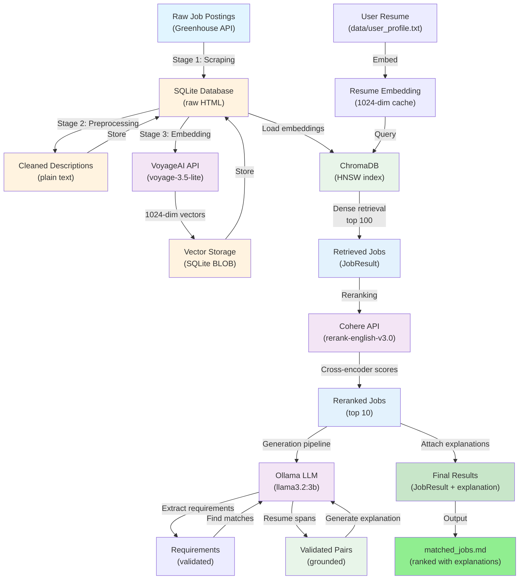

# Resume-Job-Matching-System: Technical Architecture Guide

**Last Updated:** 2026-04-02  
**System Purpose:** Resume-to-job matching pipeline — scrapes Greenhouse job boards, embeds listings via VoyageAI, retrieves candidates via dense vector search, reranks via Cohere cross-encoder, and generates fit explanations via local LLaMA 3.2 LLM.

---

## Table of Contents

1. [End-to-End Pipeline Overview](#end-to-end-pipeline-overview)
2. [Stage-by-Stage Architecture](#stage-by-stage-architecture)
3. [The Orchestration Layer](#the-orchestration-layer)
4. [Key Logic & Design Patterns](#key-logic--design-patterns)
5. [Data Structures](#data-structures)
6. [External Dependencies](#external-dependencies)
7. [Configuration & Setup](#configuration--setup)
8. [Testing Strategy](#testing-strategy)
9. [Data Flow Diagram](#data-flow-diagram)

---

## End-to-End Pipeline Overview

The Resume-Job-Matching-System orchestrates a 4-stage pipeline that transforms raw job postings into ranked, explained matches for a user's resume:

```
Raw Job Postings (Greenhouse API)
    ↓ [Stage 1: Scraping]
SQLite Database (raw HTML descriptions)
    ↓ [Stage 2: Preprocessing]
Cleaned Text Descriptions (plain text, normalized)
    ↓ [Stage 3: Embedding]
1024-dimensional Dense Vectors (VoyageAI voyage-3.5-lite)
    ↓ [Stage 4: Matching]
    ├─ Retrieval (ChromaDB HNSW, top 100)
    ├─ Reranking (Cohere cross-encoder, top 10)
    └─ Generation (Ollama LLaMA 3.2, fit explanations)
Ranked Results with Explanations
```

**Key Invariants:**
- All stages are sequential; results from stage N feed into stage N+1
- Preprocessing is lossy but deterministic (HTML → plain text)
- Embedding is stateless; vectors are serialized and cached in SQLite
- Retrieval + reranking form the core match pipeline; generation is explanatory
- External services (VoyageAI, Cohere, Ollama) are invoked with retry logic and error handling

---

## Stage-by-Stage Architecture

### Stage 1: Job Scraping

**Module:** `src/greenhouse_scraper.py`

**Purpose:** Fetch raw job listings from Greenhouse job board API and persist to SQLite.

**Key Classes & Methods:**

- **`GreenhouseJob`** (dataclass): Represents a single scraped job
  - Fields: `id`, `title`, `location`, `description` (HTML-encoded), `internal_job_id`, `updated_at`, `created_at`, `url`, `absolute_url`, `company_name`, `department`, `job_type`
  - `to_dict()`: Convert to database insertion format

- **`GreenhouseScraper`**: Orchestrates API interaction
  - Base URL: `https://boards-api.greenhouse.io/v1/boards/{board_token}/jobs`
  - `__init__(board_token, max_retries=3, backoff_factor=0.5, timeout=10)`: Initialize with retry strategy
  - `_create_session()`: Build requests.Session with HTTPAdapter for retry handling
  - `fetch_all_jobs()`: Fetch all jobs via pagination (100 per page by default)

**Data Transformation (Input → Output):**

| Input | Output | Example |
|-------|--------|---------|
| API response (JSON) | GreenhouseJob objects | `GreenhouseJob(id="123", title="Software Engineer", location="San Francisco, CA", ...)` |
| GreenhouseJob list | SQLite rows | Inserted into `jobs` table with columns: `external_id`, `title`, `location`, `description`, `source`, `source_url`, `company_name`, `department`, `job_type`, `scraped_at` |

**Error Handling:**
- Retries on network failures (via requests.Session + urllib3.Retry)
- Rate limit handling (backoff factor: 0.5, max retries: 3)
- Request timeout: 10 seconds (configurable)
- Logs warnings for failed individual job requests; continues with other jobs

**CLI Entry Point:** `scripts/pipeline/scrape_jobs.py`

---

### Stage 2: Preprocessing

**Module:** `src/preprocess.py`

**Purpose:** Transform raw HTML-encoded job descriptions into clean, normalized plain text.

**5-Step Pipeline:**

1. **Step 1: HTML Entity Unescaping** (`_step1_unescape`)
   - Decodes HTML entities up to 5 iterations (handles double-encoding)
   - Example: `&lt;p&gt;` → `<p>`, `&amp;nbsp;` → ` `

2. **Step 2: Strip Iframes & Images** (`_step2_strip_iframes_and_images`)
   - Uses BeautifulSoup to remove `<iframe>` and `` tags
   - Reduces noise and tokens for embedding

3. **Step 3: Extract Plain Text** (`_step3_extract_text`)
   - BeautifulSoup `.get_text(separator=" ")` to extract text content
   - Preserves block-level separation with spaces

4. **Step 4: Normalize Whitespace** (`_step4_normalize_whitespace`)
   - Collapses all whitespace sequences (`\s\xa0+`) to single spaces
   - Strips leading/trailing whitespace

5. **Step 5: Unicode Normalization** (`_step5_normalize_unicode_punctuation`)
   - Converts curly quotes (U+2018–U+201D), em/en dashes (U+2014, U+2013), ellipsis (U+2026) to ASCII equivalents
   - Translation table: `_UNICODE_TABLE`

**Data Transformation (Input → Output):**

| Input | Output | Example |
|-------|--------|---------|
| Raw HTML with entities | Clean plain text | `&lt;p&gt;We seek &quot;Python&quot; expert&lt;/p&gt;` → `We seek "Python" expert` |
| Multiple whitespace types | Single-space normalized | `Experience\n\n  required:\n\t3 years` → `Experience required: 3 years` |
| Unicode punctuation | ASCII equivalents | `"Deadline: 2026–2027"` → `"Deadline: 2026-2027"` |

**Key Function:**

```python
def preprocess_description(raw: str) -> str:
    """Apply all 5 preprocessing steps. Returns empty string if input is None/empty."""
```

**CLI Entry Point:** `scripts/pipeline/preprocess_jobs.py`

**Error Handling:**
- Graceful fallback to empty string on parse failures
- BeautifulSoup errors caught and logged; batch processing continues

---

### Stage 3: Embedding

**Module:** `src/embedding.py`

**Purpose:** Convert cleaned text descriptions to dense 1024-dimensional vectors via VoyageAI API.

**Key Components:**

**Client Management:**
- `create_client(api_key: str) -> voyageai.Client`: Initialize authenticated VoyageAI client
  - Validates API key is non-empty
  - Raises `ValueError` if key missing

**Batch Embedding:**
- `embed_batch(client, texts: list[str], model="voyage-3.5-lite", max_retries=3, retry_base_delay=2.0, run_id=None) -> list[np.ndarray]`
  - Embeds up to 128 texts per API call (hard limit)
  - Returns list of float32 numpy arrays, one per text
  - **Retry Logic:**
    - 4xx errors (except 429): immediate failure
    - 429 (rate limit) + transient errors: exponential backoff with jitter (±10%)
    - Max retries: 3, base delay: 2 seconds
  - **Output:** List of `np.ndarray` with shape `(1024,)` and dtype `float32`

**Serialization:**
- `serialize_embedding(embedding: np.ndarray) -> bytes`: Convert float32 array to raw bytes
  - Uses little-endian encoding; 4 bytes per float32 value
  - Stored in SQLite as BLOB

- `deserialize_embedding(blob: bytes, dim=1024) -> np.ndarray`: Reconstruct numpy array from BLOB
  - Validates blob length matches expected dimension (dim × 4 bytes)
  - Returns `np.ndarray` with shape `(1024,)` and dtype `float32`

**Data Transformation (Input → Output):**

| Input | Output | Details |
|-------|--------|---------|
| Text description (1-128 strings) | Embedding vectors (float32) | `"Python expert with 5 years..."` → `[0.234, -0.156, ..., 0.012]` (1024 dims) |
| Float32 array | Bytes (BLOB) | `np.array([0.234, ...])` → `b'\x5c\xf5\x72\x3e...'` |
| Bytes (BLOB) | Float32 array | Reconstructed for retrieval queries |

**Configuration:**
- Model: `voyage-3.5-lite` (1024-dimensional)
- Batch size: 128 (VoyageAI API limit)
- Database chunk size: 512 (chunk_size for SQLite batch processing)

**CLI Entry Point:** `scripts/pipeline/embed_jobs.py`

**Error Handling:**
- Retries with exponential backoff + jitter on transient errors
- Permanent 4xx errors fail immediately (config error)
- Failed embeddings skipped; processing continues
- Logs throughput metrics (jobs/second)

---

### Stage 4: Matching (Retrieval → Reranking → Generation)

#### 4a. Retrieval (Dense Vector Search)

**Module:** `src/retrieval.py`

**Purpose:** Execute HNSW-based nearest-neighbor search to retrieve top-100 job candidates.

**Key Data Structure:**

```python
class JobResult(TypedDict):
    """Result of a vector similarity query."""
    id: str
    distance: float
    title: str
    location: str
    source_url: str
    board_token: str
    cleaned_description: str
    required_degree: int
    seniority_level: int
    min_years_experience: int
```

**Collection Management:**

- `build_collection(conn, chroma_client, collection_name="jobs", ef_construction=100) -> chromadb.Collection`
  - Loads all embedded jobs from SQLite (WHERE `embedded=1 AND embedding IS NOT NULL`)
  - Deserializes embeddings and upserts to ChromaDB in 500-job chunks
  - Extracts metadata (degree, seniority, years) from job descriptions via regex
  - HNSW construction parameter: `ef_construction` (default: 100, used: 400 in production)
  - Idempotent: calling twice on unchanged data is a no-op (upsert overwrites by ID)
  - **Metadata stored:** title, location, source_url, board_token, cleaned_description, required_degree, seniority_level, min_years_experience

**Query Execution:**

- `query_collection(collection, query_embedding: np.ndarray, top_k=10, ef=10, where=None, run_id=None) -> list[JobResult]`
  - Performs HNSW nearest-neighbor search with optional ChromaDB where filter
  - **Parameters:**
    - `query_embedding`: 1-D float32 array of shape (1024,)
    - `top_k`: Number of results (default: 10, used: 100 in pipeline)
    - `ef`: HNSW search parameter (default: 10, used: 400 in pipeline for high recall)
    - `where`: Optional ChromaDB filter dict (e.g., `{"degree": {"$gte": 1}}`)
  - **Returns:** List of JobResult dicts, ordered by ascending distance (most similar first)
  - **Validation:** Checks query_embedding shape and dtype; raises ValueError if incorrect

**Data Transformation (Input → Output):**

| Input | Output | Example |
|-------|--------|---------|
| Resume embedding (1024-dim) | Ranked job results | Top 100 jobs by cosine distance |
| ChromaDB query result | JobResult dicts | `{id: "123", distance: 0.15, title: "Software Engineer", ...}` |
| Raw metadata from Chroma | Typed JobResult | Extracts & casts degree, seniority, years to int |

**Configuration:**
- HNSW ef_construction: 400 (high-quality index)
- HNSW ef (search): 400 (high recall)
- Top-k retrieval: 100
- SQLite chunk size: 500

**Error Handling:**
- ValueError if query embedding has wrong shape/dtype
- Logs collection size and sync progress
- Graceful handling of missing metadata (safe defaults)

---

#### 4b. Reranking (Cross-Encoder Scoring)

**Module:** `src/reranking.py`

**Purpose:** Reorder retrieved candidates using Cohere's cross-encoder to narrow to top-10 best matches.

**Client Management:**

- `create_rerank_client(api_key: str) -> cohere.ClientV2`
  - Initialize authenticated Cohere V2 client
  - Validates API key

**Core Reranking:**

- `rerank_jobs(query, jobs: list[JobResult], top_n=10, api_key=None, client=None, max_retries=3, retry_base_delay=2.0, run_id=None) -> list[JobResult]`
  - Takes resume text and retrieved jobs; reranks by relevance
  - **Input transformation:**
    - Resume text → query (unchanged)
    - Each JobResult → formatted string: `{title} | {location} | {seniority}\n{cleaned_description}`
    - Seniority levels: 1→"Entry-level", 2→"Mid-level", 3→"Senior", 4→"Staff"
  - **API Call:** `co.rerank(model="rerank-english-v3.0", query=resume, documents=documents, top_n=top_n)`
  - **Returns:** Reranked list of JobResult dicts, best first (indices from response.results)
  - **Retry Logic:**
    - Exponential backoff with jitter (±10%)
    - Detects 429 (rate limit) vs other errors and logs appropriately
    - Max retries: 3, base delay: 2 seconds

**Batch Reranking:**

- `batch_rerank_jobs(queries_and_jobs: list[tuple[str, list[JobResult]]], ...) -> list[list[JobResult]]`
  - Processes multiple (query, jobs) pairs sequentially
  - Throttles between requests: `inter_request_delay=7` seconds (to avoid rate limits)

**Data Transformation (Input → Output):**

| Input | Output | Details |
|-------|--------|---------|
| Resume text + 100 jobs | 10 reranked jobs | Cohere scores each job; top 10 returned |
| JobResult dict | Formatted string | Title, location, seniority, description combined |
| Rerank response indices | Reranked JobResult list | Maps response indices back to original JobResult objects |

**Configuration:**
- Model: `rerank-english-v3.0`
- Top-N: 10
- Max retries: 3
- Retry base delay: 2 seconds
- Inter-request delay: 7 seconds

**Error Handling:**
- Retries on 429 (rate limit) and transient errors (network, timeout)
- Logs detailed error context (run_id, attempt count)
- Fails hard after all retries exhausted
- Empty job list returns empty list immediately

---

#### 4c. Generation (Fit Explanation via LLM)

**Module:** `src/generation.py`

**Purpose:** Generate grounded, evidence-based fit explanations for each matched job by:
1. Extracting required skills from job posting (LLM)
2. Finding matching text spans in resume (LLM)
3. Validating spans via substring search (no LLM hallucinations)
4. Generating brief fit explanation (LLM)

**Key Data Structures:**

```python
class RequirementMatch(TypedDict):
    """One grounded requirement-resume pair."""
    requirement: str      # exact span from job posting
    resume_match: str     # exact span from resume

class PairResult(TypedDict):
    """Output for one (resume, job_posting) pair."""
    explanation: str
    validated_pairs: list[RequirementMatch]
    num_validated_pairs: int
    hallucination_count: int
    flagged_for_review: bool
```

**Pipeline Functions:**

1. **`extract_requirements(job_posting, model=OLLAMA_MODEL, run_id=None) -> list[str]`**
   - Sends job posting to LLM with prompt: "Extract top 3-5 required skills (copy exact text)"
   - Parses response (strips numbering: "1.", "-", "*")
   - **Validates each span exists in original job posting** (prevents hallucinations)
   - Returns list of validated spans

2. **`find_resume_matches(resume, requirements, model=OLLAMA_MODEL, run_id=None) -> tuple[list[RequirementMatch], int]`**
   - For each requirement, searches resume for matching text
   - LLM prompt: "Find shortest exact phrase in resume that demonstrates this requirement"
   - Parses response; "NOT FOUND" → skip (not a hallucination)
   - **Normalizes whitespace and validates span exists in resume** (prevents hallucinations)
   - Counts hallucinations (LLM returned non-None but span not found)
   - Returns validated pairs list and hallucination count

3. **`filter_pairs(pairs: list[tuple[str, str]], ...) -> tuple[list[...], str | None]`**
   - Processes batch; filters out pairs with zero validated matches
   - If all pairs filtered: returns `([], CORPUS_LIMITATION_MESSAGE)`
   - Otherwise: returns `(retained_pairs, None)` where each pair includes validated_pairs and hallucination_count

4. **`generate_explanation(validated_pairs: list[RequirementMatch], ...) -> str`**
   - Sends validated pairs to LLM: "Generate 1-2 sentences explaining fit (use ONLY provided pairs)"
   - Returns explanation string

5. **`run_generation_pipeline(pairs: list[tuple[str, str]], ...) -> list[PairResult] | str`**
   - Main orchestration: filters → generates explanations → logs results
   - Returns list of PairResult dicts, or CORPUS_LIMITATION_MESSAGE if all filtered
   - Max batch size: 2 (config: `MAX_BATCH_SIZE`)

**LLM Configuration:**
- Model: `llama3.2:3b-instruct-q4_K_M` (local Ollama)
- Temperature: 0.7
- Top-p: 0.9
- Max tokens: 150
- Request timeout: implicit (via ollama library)

**Data Transformation (Input → Output):**

| Input | Output | Example |
|-------|--------|---------|
| Job posting text | Required skills | `["Python", "5+ years SQL", "AWS"]` |
| Resume + requirement | Resume span | Requirement: `"Python"` → Resume match: `"expert in Python"` |
| Validated pairs | Explanation | Pairs: `[{requirement: "Python", resume_match: "expert in Python"}]` → Explanation: `"Candidate has strong Python skills matching role requirements."` |

**Error Handling:**
- LLM validation prevents hallucinations; spans must exist in source text
- Whitespace normalization handles minor formatting differences
- Ollama connection errors caught; remaining jobs skip generation (logged)
- Individual job failures don't abort batch; marked as `explanation=None`

**Hallucination Detection & Flagging:**
- Counts "hallucinations" (LLM returned non-None, but span not in text)
- Flags PairResult for manual review if `hallucination_count > 0`
- Logs at WARNING level with hallucination count

---

## The Orchestration Layer

**Primary Orchestration Script:** `scripts/pipeline/match_jobs.py`

**Purpose:** Coordinate all pipeline stages (retrieval, reranking, generation) and manage state flow.

### Main Function Flow

```python
def main() -> None:
    """Main orchestration function."""
```

**Initialization & Validation:**

1. **Parse CLI arguments:**
   - `--db-path`: SQLite database path (optional)
   - `--resume-path`: Path to resume file (default: `data/user_profile.txt`)
   - `--output-path`: Output markdown file (default: `matched_jobs.md`)
   - `--log-level`: Logging level (default: INFO)
   - `--rebuild`: Rebuild ChromaDB collection

2. **Configure logging** (after argparse):
   ```python
   logging.basicConfig(level=getattr(logging, args.log_level), format="...")
   ```

3. **Load environment variables:** `load_dotenv()`

4. **Validate required API keys early:**
   - `VOYAGE_API_KEY` → VoyageAI embedding client
   - `COHERE_API_KEY` → Cohere reranking client
   - Exits with error if missing

5. **Pre-flight check:** Ensure Ollama is reachable
   ```python
   ollama.list()  # Raises RequestError/ResponseError if unreachable
   ```

6. **Generate run_id:** Unique UUID for request tracing across all stages

### Data Loading & Resume Preparation

7. **Load resume text:**
   ```python
   resume_text = load_resume(args.resume_path)  # Loads from file, validates non-empty
   ```

8. **Extract user profile criteria:**
   ```python
   query_filter = extract_user_filters(resume_text)
   ```
   - Uses regex extraction functions to detect: degree, seniority, years of experience
   - Builds ChromaDB where filter dict (e.g., `{"seniority_level": {"$gte": 2}}`)

9. **Load or embed resume:**
   ```python
   query_embedding = load_or_embed_resume(voyage_client, resume_text)
   ```
   - Cache: `.npy` file + MD5 hash file
   - Hit: Load cached embedding if hash matches
   - Miss: Embed via VoyageAI, save to cache
   - Fallback: Re-embed on cache load failure

### Collection Building & Database Connection

10. **Build ChromaDB client:**
    ```python
    chroma_client = build_chroma_client(CHROMA_DEFAULT_DIR, rebuild=args.rebuild)
    ```
    - Creates persistent Chroma client
    - Optionally clears collection (if `--rebuild` flag)

11. **Connect to SQLite database:**
    ```python
    conn = sqlite3.connect(db_path)
    ```
    - Validates database exists (exits if missing)

### Core Matching Pipeline

12. **Build Chroma collection from embeddings:**
    ```python
    collection = build_collection(conn, chroma_client, CHROMA_COLLECTION_NAME, ...)
    ```
    - Loads all embedded jobs from SQLite
    - Syncs to Chroma (idempotent upsert)
    - Times operation and logs collection count

13. **Execute retrieval (Step 1):**
    ```python
    candidates = query_collection(collection, query_embedding, top_k=100, ef=400, where=query_filter, run_id=run_id)
    ```
    - Dense vector search: top 100 candidates
    - Filtered by user profile criteria (optional)
    - Times operation; logs candidate count

14. **Execute reranking (Step 2):**
    ```python
    results = rerank_jobs(resume_text, candidates, top_n=10, api_key=cohere_api_key, run_id=run_id)
    ```
    - Cohere cross-encoder: rerank to top 10
    - Times operation; logs result count

15. **Execute generation (Step 3):**
    ```python
    run_generation_for_results(resume_text, results, run_id=run_id)
    ```
    - For each reranked job, generates fit explanation
    - Attaches explanation to result dict or sets to None
    - Handles Ollama unavailability gracefully

### Output & Cleanup

16. **Write results to markdown:**
    ```python
    write_results_markdown(results, args.output_path)
    ```
    - Filters jobs with explanations
    - Formats as markdown with title, URL, fit summary
    - Includes extracted years-of-experience if detected

17. **Close database connection:**
    ```python
    conn.close()
    ```

### Error Handling & Recovery

- **API Key Validation:** Exits early if VOYAGE_API_KEY or COHERE_API_KEY missing
- **Ollama Pre-flight:** Exits early if Ollama unreachable (prevents silent failures)
- **Database Validation:** Exits if database not found
- **Collection Empty Check:** Exits if no embedded jobs found
- **Generation Failure:** Catches Ollama errors per-job; marks as `explanation=None`; continues
- **SQLite Errors:** Caught at top level; logged with context

### Key Helper Functions

**`load_resume(resume_path=None) -> str`**
- Loads resume from file
- Validates non-empty; exits on error

**`extract_user_filters(resume_text) -> dict | None`**
- Extracts degree, seniority, years from resume text
- Returns ChromaDB where filter dict or None

**`_resume_hash(resume_text) -> str`**
- Computes MD5 hash for cache invalidation

**`load_or_embed_resume(client, resume_text, cache_path, hash_path) -> np.ndarray`**
- Caching layer for resume embedding
- Checks hash; loads or re-embeds; saves to cache

**`build_chroma_client(chroma_dir, rebuild) -> ClientAPI`**
- Creates persistent ChromaDB client
- Optionally clears collection

**`run_generation_for_results(resume_text, results, model, run_id)`**
- Wrapper around `run_generation_pipeline()`
- Attaches explanation to each result dict in-place
- Handles Ollama errors gracefully (sets `explanation=None`, logs, continues)

**`write_results_markdown(results, output_path)`**
- Writes ranked jobs to markdown file
- Filters to only jobs with explanations
- Formats with title, board token, URL, min years, fit summary

### Timing Instrumentation

All major stages are timed with `time.monotonic()`:
- Collection building: `elapsed_build`
- Resume embedding: `elapsed_resume`
- Dense retrieval: `elapsed_query`
- Reranking: `elapsed_rerank`
- Generation: `elapsed_gen`

Times logged at INFO level for observability.

---

## Key Logic & Design Patterns

### Dependency Injection Pattern

API clients are created once at module level and passed to functions:

```python
# src/embedding.py
def create_client(api_key: str) -> voyageai.Client:
    """Create authenticated VoyageAI client."""
    return voyageai.Client(api_key=api_key)

# scripts/pipeline/match_jobs.py
voyage_client = create_client(voyage_api_key)
query_embedding = load_or_embed_resume(voyage_client, resume_text)
```

**Benefits:**
- Testability: clients can be mocked
- Reusability: one client for multiple calls (connection pooling)
- Separation of concerns: modules don't load env vars; caller does

### Error Handling & Retry Logic

**Exponential Backoff with Jitter:**
- Base delay: 2 seconds (embedding, reranking)
- Formula: `delay = base * (2 ** (attempt - 1)) + random_jitter`
- Jitter: ±10% of delay (prevents thundering herd)
- Max retries: 3 (typically)

```python
# src/embedding.py
attempt = 0
while True:
    try:
        result = client.embed(texts, model=model, input_type=None)
        return [np.array(vec, dtype=np.float32) for vec in result.embeddings]
    except Exception as exc:
        # Fast-fail on permanent 4xx errors
        if ("40" in exc_str and "429" not in exc_str) or exc_str.startswith("4"):
            logger.error("...")
            raise
        
        # Transient error: retry with backoff
        attempt += 1
        if attempt > max_retries:
            raise
        delay = retry_base_delay * (2 ** (attempt - 1))
        delay += random.uniform(0, delay * 0.1)
        time.sleep(delay)
```

**Error Categories:**
1. **Transient (Retryable):** 429 (rate limit), network errors, timeouts
2. **Permanent (Fast-Fail):** 4xx errors (except 429), auth failures
3. **Pipeline-Level:** Ollama unreachable → skip generation gracefully

### Hallucination Detection & Validation

Generation module validates all LLM outputs via exact substring search:

```python
# src/generation.py
def extract_requirements(job_posting, ...) -> list[str]:
    # Extract skills via LLM
    candidate_spans = _parse_requirements(response)
    # Validate each exists in original text
    validated = [span for span in candidate_spans if _span_exists_in_text(span, job_posting)]
    return validated
```

**Prevents:**
- LLM-generated text that isn't in source material
- Hallucinations counted separately; results flagged for review

### Caching Strategy

**Resume Embedding Cache:**
- File: `data/user_profile_embedding.npy`
- Hash file: `data/user_profile_embedding_hash.txt`
- Hash function: MD5 of resume text
- Logic: Load cached if hash matches; re-embed on miss or hash mismatch

```python
# scripts/pipeline/match_jobs.py
current_hash = _resume_hash(resume_text)
if cache.exists() and hash_file.exists():
    saved_hash = hash_file.read_text().strip()
    if saved_hash == current_hash:
        return np.load(str(cache))  # Cache hit
# Cache miss: embed, save, cache hash
```

**Benefits:**
- Avoid re-embedding resume on repeated runs
- Invalidated on resume text changes (MD5 mismatch)
- Fallback to re-embedding on load failure

### Metadata Extraction from Job Descriptions

Regex-based extraction (no LLM) of structured criteria from job posting text:

```python
# src/regex_extraction.py (imported by src/retrieval.py)
extract_degree_requirement(description) -> int       # DEGREE_UNKNOWN | DEGREE_BACHELOR | ...
extract_seniority_level(description) -> int          # SENIORITY_UNKNOWN | SENIORITY_ENTRY | ...
extract_years_experience(description) -> int         # years or YEARS_UNKNOWN
extract_seniority_from_title(title) -> int           # fallback: parse "Senior Engineer" etc.
```

**Used By:**
- Retrieval: stored as metadata in ChromaDB for potential filtering
- Reranking: seniority level included in formatted document

### Configuration Management

Two-level configuration:
1. **Core config** (`src/config.py`): Shared across all modules
   - Model names, API limits, embedding dimensions
   - Retry parameters, batch sizes
   - No environment variable loading
2. **Eval-specific config** (`src/eval/eval_config.py`): Separate for evaluation subsystem

```python
# src/config.py
VOYAGE_MODEL: str = "voyage-3.5-lite"
EMBEDDING_DIM: int = 1024
HNSW_EF_CONSTRUCTION: int = 400
COHERE_RERANK_MODEL: str = "rerank-english-v3.0"
RERANK_TOP_N: int = 10
```

---

## Data Structures

### Core Pipeline Data Structures

**JobResult** (TypedDict, `src/retrieval.py`)
```python
class JobResult(TypedDict):
    id: str                           # Job ID from database
    distance: float                   # Cosine distance from retrieval
    title: str
    location: str
    source_url: str
    board_token: str                  # Greenhouse board identifier
    cleaned_description: str          # Plain text description
    required_degree: int              # 0=unknown, 1=bachelor, 2=master, 3=phd
    seniority_level: int              # 0=unknown, 1=entry, 2=mid, 3=senior
    min_years_experience: int         # Minimum years required (-1 if unknown)
```

**RequirementMatch** (TypedDict, `src/generation.py`)
```python
class RequirementMatch(TypedDict):
    requirement: str                  # Exact span from job posting
    resume_match: str                 # Exact span from resume
```

**PairResult** (TypedDict, `src/generation.py`)
```python
class PairResult(TypedDict):
    explanation: str                  # Fit explanation (1-2 sentences)
    validated_pairs: list[RequirementMatch]
    num_validated_pairs: int
    hallucination_count: int          # Count of LLM hallucinations detected
    flagged_for_review: bool          # True if hallucination_count > 0
```

**GreenhouseJob** (dataclass, `src/greenhouse_scraper.py`)
```python
@dataclass
class GreenhouseJob:
    id: str
    title: str
    location: str
    description: str                  # HTML-encoded
    internal_job_id: int
    updated_at: str                   # ISO timestamp
    created_at: str                   # ISO timestamp
    url: str
    absolute_url: str
    company_name: Optional[str]
    department: Optional[str]
    job_type: Optional[str]
```

### Database Schema (SQLite)

**Table: `jobs`**

| Column | Type | Notes |
|--------|------|-------|
| `id` | INTEGER PRIMARY KEY | Auto-increment |
| `external_id` | TEXT UNIQUE | Greenhouse job ID |
| `title` | TEXT | Job title |
| `location` | TEXT | Job location |
| `description` | TEXT | Raw HTML-encoded description |
| `cleaned_description` | TEXT | Plain text (added by preprocess stage) |
| `source` | TEXT | Always "greenhouse" |
| `source_url` | TEXT | Job posting URL |
| `company_name` | TEXT | Company name (optional) |
| `department` | TEXT | Department (optional) |
| `job_type` | TEXT | Job type (optional) |
| `scraped_at` | TEXT | ISO timestamp |
| `embedding` | BLOB | Serialized 1024-dim float32 vector (added by embed stage) |
| `preprocessed` | INTEGER | 1 if cleaned_description set, 0 otherwise |
| `embedded` | INTEGER | 1 if embedding set, 0 otherwise |

### API Response Structures

**Voyage AI `embed()` response:**
```python
result.embeddings: list[list[float]]  # List of vectors, one per text
# Each vector: [0.234, -0.156, ..., 0.012] with 1024 dimensions
```

**Cohere `rerank()` response:**
```python
response.results: list[cohere.RerankResult]
# Each result: RerankResult(index=5, relevance_score=0.87)
```

**Ollama `chat()` response:**
```python
response["message"]["content"]: str  # LLM response text
```

---

## External Dependencies

### VoyageAI API

**Purpose:** Generate dense embeddings (1024-dim vectors) from job descriptions

**Integration Point:** `src/embedding.py`

**Client:** `voyageai.Client(api_key=...)`

**Method:** `client.embed(texts: list[str], model="voyage-3.5-lite", input_type=None) -> Result`

**Configuration:**
- Model: `voyage-3.5-lite`
- Output dimension: 1024
- Batch size: 128 (hard API limit)

**Error Handling:**
- Retries on 429 (rate limit), network errors
- Fast-fails on 4xx errors (except 429)
- Max retries: 3, base delay: 2 seconds

**Cost Implications:**
- Per token (1000 tokens ≈ $0.10)
- Batch embedding more efficient than per-request

### Cohere API

**Purpose:** Cross-encoder reranking to narrow retrieval results to top-10

**Integration Point:** `src/reranking.py`

**Client:** `cohere.ClientV2(api_key=...)`

**Method:** `co.rerank(model="rerank-english-v3.0", query=..., documents=..., top_n=...)`

**Configuration:**
- Model: `rerank-english-v3.0`
- Max retries: 3, base delay: 2 seconds
- Inter-request delay: 7 seconds (batch throttling)

**Error Handling:**
- Retries on 429, transient errors
- Distinguishes 429 from other 4xx in logging
- Fails after max retries exhausted

### ChromaDB

**Purpose:** Persistent vector index for dense similarity search

**Integration Points:**
- `src/retrieval.py`: build_collection(), query_collection()
- Storage: `data/chroma/` directory

**Configuration:**
- Collection name: `"jobs"`
- Index type: HNSW
- ef_construction: 400 (high-quality index build)
- ef (search): 400 (high recall)

**Operations:**
- `get_or_create_collection()`: Create or retrieve collection
- `upsert()`: Insert or update jobs and embeddings (idempotent)
- `query()`: Dense vector search with optional where filter
- `delete_collection()`: Clear collection (rebuild mode)

**Persistence:**
- Automatic disk persistence to `data/chroma/`
- No explicit commits required

### Ollama (Local LLM)

**Purpose:** Generate fit explanations via local LLaMA 3.2 model

**Integration Point:** `src/generation.py`

**Client:** `ollama` library (HTTP API)

**Model:** `llama3.2:3b-instruct-q4_K_M`
- 3 billion parameters
- Quantized 4-bit (reduced memory/latency)
- Instruction-tuned (good at following prompts)

**Method:** `ollama.chat(model=..., messages=[...], options={...})`

**Configuration:**
- Temperature: 0.7 (balanced creativity)
- Top-p: 0.9 (nucleus sampling)
- Max tokens: 150 (short explanations)

**Error Handling:**
- Catches `ollama.RequestError` (connection failed) → skips generation gracefully
- Catches `ollama.ResponseError` (model error) → marks job as `explanation=None`
- Pre-flight check in main: exits early if Ollama unreachable

**Requirements:**
- Ollama service must be running
- Model must be pulled: `ollama pull llama3.2:3b-instruct-q4_K_M`

### SQLite

**Purpose:** Persistent storage of jobs, embeddings, preprocessing state

**Integration Points:**
- All pipeline scripts: `scripts/pipeline/*.py`
- Retrieval module: `src/retrieval.py` (load embeddings)

**Operations:**
- Batch insert: scraped jobs
- Batch update: preprocessing state, embeddings
- Select: load embedded jobs for Chroma sync

**Performance Tuning:**
- Chunk size: 512 (batch processing large result sets)
- Chunk size (Chroma sync): 500 (prevent memory bloat)
- Pragmas: None explicitly set (use defaults)

---

## Configuration & Setup

### Environment Variables

**Required (must be set in `.env` or environment):**

```bash
VOYAGE_API_KEY=<your-voyage-ai-api-key>
COHERE_API_KEY=<your-cohere-api-key>
```

**Optional:**

```bash
DB_PATH=<custom-database-path>          # Default: data/jobs.db
GREENHOUSE_BOARD_TOKENS=<comma-separated-tokens>  # For scraper
```

**Note:** Environment variables are NOT loaded by `src/` modules. Scripts use `load_dotenv()` and pass values explicitly.

### Project Structure

```
Resume-Job-Matching-System/
├── src/
│   ├── __init__.py
│   ├── config.py                      # Core configuration
│   ├── db_utils.py                    # SQLite utilities
│   ├── embedding.py                   # VoyageAI integration
│   ├── generation.py                  # LLM generation pipeline
│   ├── greenhouse_scraper.py          # Job scraper
│   ├── preprocess.py                  # Text normalization
│   ├── regex_extraction.py            # Metadata extraction
│   ├── retrieval.py                   # ChromaDB interface
│   ├── reranking.py                   # Cohere integration
│   └── eval/                          # Evaluation subsystem
│       ├── types.py
│       ├── eval_config.py
│       ├── data_loading.py
│       ├── embedding_cache.py
│       ├── collection.py
│       ├── metrics.py
│       ├── reporting.py
│       ├── eval_utils.py
│       ├── positive_gen/
│       │   ├── positives_gen.py
│       │   ├── positives_validate.py
│       │   ├── positives_repair.py
│       │   └── positives_pipeline.py
│       └── negative_gen/
│           ├── negatives_gen.py
│           ├── negatives_validate.py
│           └── negatives_repair.py
├── scripts/
│   ├── pipeline/
│   │   ├── scrape_jobs.py             # Stage 1: Scraping
│   │   ├── preprocess_jobs.py         # Stage 2: Preprocessing
│   │   ├── embed_jobs.py              # Stage 3: Embedding
│   │   └── match_jobs.py              # Stage 4: Matching (main orchestrator)
│   └── eval/
│       ├── generate_synthetic_positives.py
│       ├── generate_synthetic_negatives.py
│       ├── stratify_and_split.py
│       ├── run_tuning_eval.py
│       └── run_test_eval.py
├── data/
│   ├── jobs.db                        # SQLite database (created by scraper)
│   ├── chroma/                        # ChromaDB persistent storage
│   ├── user_profile.txt               # User's resume (must be created)
│   ├── user_profile_embedding.npy     # Cached resume embedding
│   └── user_profile_embedding_hash.txt
├── outputs/                           # Eval results
├── tests/                             # pytest suite
├── requirements.txt
├── .env                               # API keys (not in version control)
└── matched_jobs.md                    # Output: ranked jobs with explanations
```

### Installation & Setup

**1. Clone and create virtual environment:**
```bash
git clone <repo>
cd Resume-Job-Matching-System
python -m venv venv
source venv/bin/activate  # On Windows: venv\Scripts\activate
```

**2. Install dependencies:**
```bash
pip install -r requirements.txt
```

**3. Create `.env` file with API keys:**
```bash
cat > .env << EOF
VOYAGE_API_KEY=<your-key>
COHERE_API_KEY=<your-key>
GREENHOUSE_BOARD_TOKENS=<comma-separated-tokens>  # Optional for scraper
EOF
```

**4. Place resume in `data/user_profile.txt`:**
```bash
cat > data/user_profile.txt << EOF
Your resume text here...
EOF
```

**5. Ensure Ollama is running:**
```bash
ollama serve &
ollama pull llama3.2:3b-instruct-q4_K_M
```

**6. Run the pipeline:**
```bash
# Stage 1: Scrape jobs
python scripts/pipeline/scrape_jobs.py

# Stage 2: Preprocess descriptions
python scripts/pipeline/preprocess_jobs.py

# Stage 3: Embed jobs
python scripts/pipeline/embed_jobs.py

# Stage 4: Match jobs to resume
python scripts/pipeline/match_jobs.py

# Output: matched_jobs.md
cat matched_jobs.md
```

### Runtime Configuration

**Argument Overrides (match_jobs.py):**
```bash
python scripts/pipeline/match_jobs.py \
  --db-path data/jobs.db \
  --resume-path data/user_profile.txt \
  --output-path matched_jobs.md \
  --log-level DEBUG \
  --rebuild  # Force rebuild ChromaDB collection
```

**Tuning Parameters in `src/config.py`:**

| Parameter | Value | Impact |
|-----------|-------|--------|
| `RETRIEVE_TOP_K` | 100 | Dense retrieval candidates (higher = more computation) |
| `HNSW_EF` | 400 | Search parameter (higher = better recall, slower) |
| `RERANK_TOP_N` | 10 | Final results count |
| `GENERATION_TEMPERATURE` | 0.7 | LLM creativity (0.0 = deterministic, 1.0 = random) |
| `PROMPT_MAX_CHARS` | 8000 | Safety guard for LLM token overflow |

---

## Testing Strategy

### Test Structure

**Tests mirror source layout:**
```
tests/
├── test_preprocess.py              # Unit: preprocess.py
├── test_embedding.py               # Unit: embedding.py
├── test_retrieval.py               # Integration: ChromaDB
├── test_reranking.py               # Unit: reranking.py
├── test_generation.py              # Unit: generation.py
├── test_greenhouse_scraper.py      # Unit: greenhouse_scraper.py
├── test_pipeline_e2e.py            # E2E: full pipeline
├── test_match_jobs.py              # Integration: orchestrator
└── eval/                           # Eval subsystem tests
    ├── test_positives_gen.py
    ├── test_negatives_gen.py
    └── ...
```

### Mocking Strategy

**External Services Mocked:**
- `voyageai.Client`: Mocked in embedding tests (no API calls)
- `cohere.ClientV2`: Mocked in reranking tests
- `ollama`: Mocked in generation tests (except integration tests)
- `requests.Session`: Mocked in scraper tests

**Real Dependencies:**
- SQLite: Real database in `conftest.py` fixture
- ChromaDB: Real collection (in-memory or temp directory) in `test_retrieval.py`
- Numpy/BeautifulSoup: Real libraries (light dependencies)

### Running Tests

**All tests:**
```bash
pytest
```

**With coverage:**
```bash
pytest --cov=src
```

**Specific test file:**
```bash
pytest tests/test_retrieval.py -v
```

**Integration tests only:**
```bash
pytest tests/test_pipeline_e2e.py -v
```

### Test Fixtures

**`conftest.py`:**
- `mock_voyage_client`: Mocked VoyageAI client
- `mock_cohere_client`: Mocked Cohere client
- `mock_ollama`: Mocked Ollama
- `temp_db`: Temporary SQLite database with sample jobs
- `chroma_client`: In-memory ChromaDB for testing

---

## Data Flow Diagram



### Data Transformation Examples

**Example 1: Raw → Preprocessed → Embedded**

```
Raw (HTML):
"&lt;p&gt;We seek a Python expert with &quot;strong&quot; skills&lt;/p&gt;"

Preprocessed (plain text):
"We seek a Python expert with "strong" skills"

Embedded (1024 dims):
[0.234, -0.156, 0.421, ..., 0.012]  # float32 values

Serialized (BLOB):
b'\x5c\xf5\x72\x3e...'  # 4096 bytes (1024 floats × 4 bytes each)
```

**Example 2: Retrieval → Reranking**

```
Retrieved (100 jobs):
[
  {id: "1", distance: 0.15, title: "Software Engineer", ...},
  {id: "2", distance: 0.18, title: "Python Developer", ...},
  ...
]

Reranked (10 jobs, by Cohere score):
[
  {id: "2", distance: 0.18, title: "Python Developer", ...},  # Rank 1
  {id: "1", distance: 0.15, title: "Software Engineer", ...},  # Rank 2
  ...
]
```

**Example 3: Generation Pipeline**

```
Input Job:
{
  id: "456",
  title: "Senior Python Engineer",
  description: "Looking for Python expert with 5+ years AWS experience..."
}

Extracted Requirements (LLM, validated):
["Python", "5+ years", "AWS"]

Resume Matches (LLM, validated):
[
  {requirement: "Python", resume_match: "expert in Python"},
  {requirement: "5+ years", resume_match: "5 years of experience"},
  {requirement: "AWS", resume_match: "AWS certification"}
]

Explanation (LLM):
"Candidate has strong Python expertise and AWS experience matching role requirements."

Final Result:
{
  id: "456",
  title: "Senior Python Engineer",
  ...,
  explanation: "Candidate has strong Python expertise and AWS experience matching role requirements.",
  validated_pairs: [...]
}
```

---

## Summary

This system implements a production-grade pipeline for resume-job matching with the following strengths:

1. **Modular Design:** Each stage (scrape, preprocess, embed, retrieve, rerank, generate) is independently testable
2. **Error Resilience:** Retry logic, graceful degradation, pre-flight checks
3. **Observability:** Comprehensive logging with timing metrics and run_id tracing
4. **Validation:** All LLM outputs validated via substring search; hallucinations detected
5. **Caching:** Resume embeddings cached with hash invalidation
6. **Configurability:** Central config file; CLI argument overrides; tunable parameters
7. **Extensibility:** API client injection; stateless functions; clear interfaces

### Key Files for Reference

- **Pipeline Orchestrator:** `scripts/pipeline/match_jobs.py` (468 lines)
- **Core Modules:**
  - Embedding: `src/embedding.py` (156 lines)
  - Retrieval: `src/retrieval.py` (244 lines)
  - Reranking: `src/reranking.py` (181 lines)
  - Generation: `src/generation.py` (477 lines)
  - Preprocessing: `src/preprocess.py` (86 lines)
- **Configuration:** `src/config.py` (70 lines)
- **Tests:** 19 test files covering core pipeline + eval system

### Getting Started

New contributors should:
1. Read this guide
2. Review `scripts/pipeline/match_jobs.py` (orchestrator entry point)
3. Examine test files for integration examples
4. Trace data flow through modules (imports show dependencies)
5. Run tests locally: `pytest --cov=src`
