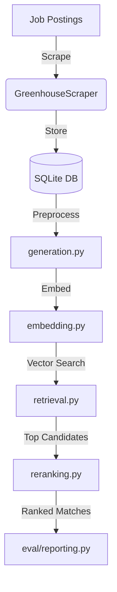

# Repository Architecture Map

## Core Components

### Data Processing
- `src/preprocess.py`: HTML cleaning pipeline (5-step normalization)
- `src/regex_extraction.py`: Pattern matching for job requirements (seniority, years, etc)
- `scripts/pipeline/preprocess_jobs.py`: Job preprocessing pipeline

### Database
- `src/db_utils.py`: SQLite utilities (schema migrations)
- `src/embedding.py`: VoyageAI embeddings (serialization, batch processing)

### Evaluation System
#### Positive Generation
- `src/eval/positive_gen/`: Generate matching job postings
  - `positives_gen.py`: Core job skeleton generation using LLMs
  - `positives_repair.py`: Fix invalid job skeletons via LLM feedback
  - `positives_validate.py`: Validate job-resume alignment
  - `positives_pipeline.py`: End-to-end pipeline (generate → validate → repair)

#### Negative Generation  
- `src/eval/negative_gen/`: Generate mismatched job postings
  - `negatives_gen.py`: Create mismatches (seniority, skills, etc)
  - `negatives_repair.py`: Fix invalid mismatches via LLM feedback
  - `negatives_validate.py`: Validate mismatch quality

#### Evaluation Infrastructure
- `src/eval/collection.py`: ChromaDB collection management (tune/test splits)
- `src/eval/data_loading.py`: Data sampling and SQLite queries
- `src/eval/embedding_cache.py`: Embedding caching with hash verification
- `src/eval/metrics.py`: Evaluation metrics (precision@k, recall@k)
- `src/eval/reporting.py`: Results reporting (JSON, CSV)
- `src/eval/types.py`: Type definitions (TypedDicts)

### Job Matching

### Key Workflow

- `src/generation.py`: Core matching pipeline (requirements → matches)
- `src/retrieval.py`: Job retrieval from ChromaDB (vector search)
- `src/reranking.py`: Cohere-based reranking (contextual relevance)

### Scraping
- `src/greenhouse_scraper.py`: Greenhouse job board scraping (published jobs)

## Scripts
- `scripts/eval/`: Evaluation runners
  - `run_test_eval.py`: Test evaluation runner
  - `run_tuning_eval.py`: Tuning evaluation runner

## Tests
- `tests/`: Unit tests
  - `test_eval_types.py`: Type validation tests
  - `test_generation.py`: Generation pipeline tests
  - `test_reranking.py`: Reranking tests

## Configuration
- `.gitignore`: Git ignore rules (Python, IDE, logs, etc)
